# Lab 200 - Adding Update and Edit Pages to the Web Application

## Introduction

 This lab will walk you through adding pages to your application, adding data and editing data inside the Visual Builder Cloud Service.

## Objectives

- Create Pages to Add and Edit Content
  - Create a page to allow users to add data
  - Create a page to allow users to edit data

## Required Artifacts

- This lab assumes that you have completed the [lab 100](/LabGuide100.md).

# Add Create and Edit Pages

Now that we have a display of our data, the next step is to allow additions and edits to that data. This will allow users to add new wines as they become available and edit the inventory/reserved counts.

### Add Create Page

- Oracle Autonomous Visual Builder makes adding pages for updating and editing data very easy with the **Quick Start** menu we accessed earlier. In the **Designer View** of our app, click inside the list component but outside an individual item so that the List is selected and the **List View** tag is displayed.

- This will allow you to access the **Quick Start** icon and menu where we'll select **Add Create Page**.

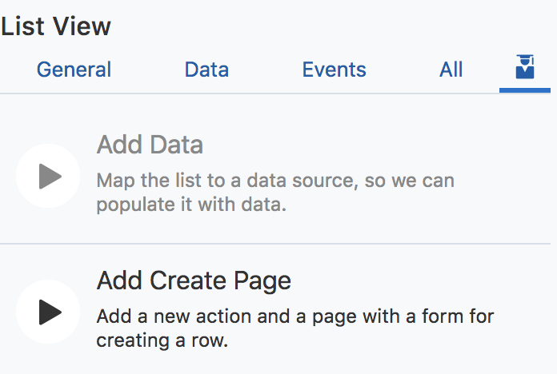

- This will bring up the **Add Create Page**. For the first step, we will leave the endpoint set as **POST /Inventory** and click **Next**. This will bring us to the **Page Detail** step where we can select the fields we would like to make available for creating new records. We'll select the following:

  - name
  - variant
  - inventory
  - reserved

- Also adjust the **Button Label** to simply "Create" and click **Finish**.

  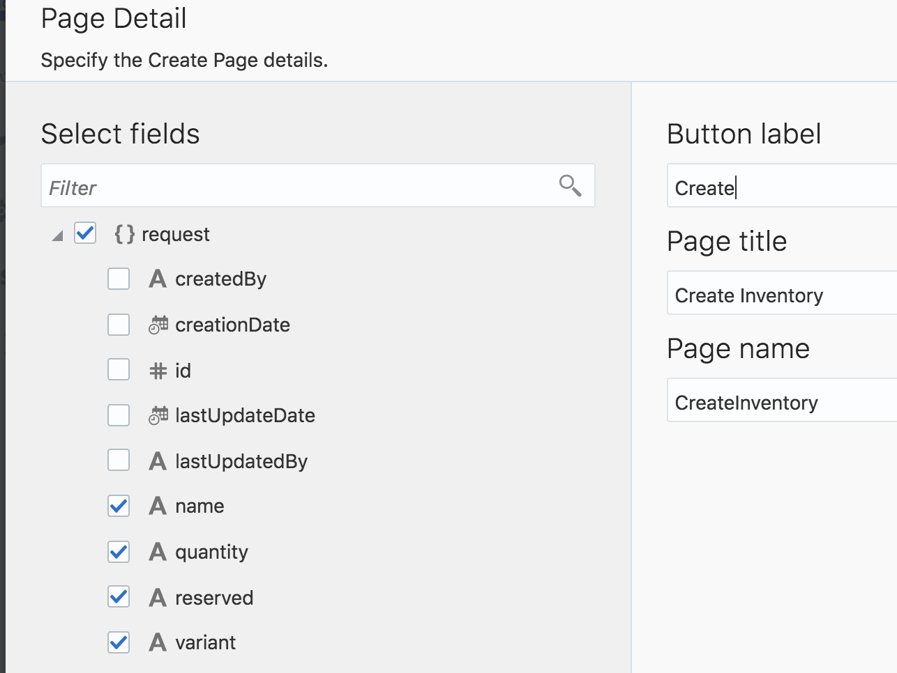

- You will be presented with the main page of the app again. In order to view the new Create Page click the icon to expand the left panel, select the monitor icon which represents web apps, and if you have not expanded the app's layout expand **InventoryWebApp** > **flows** > **main** and select **CreateInventory**.

  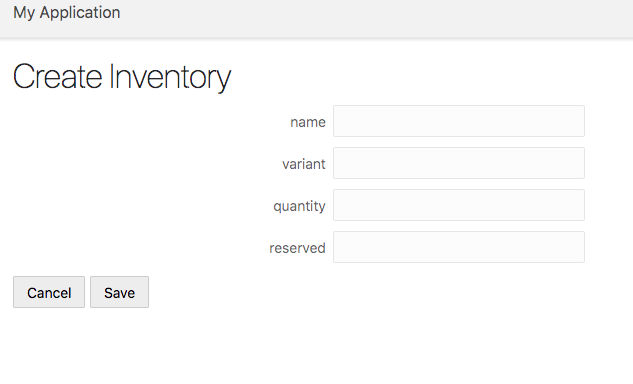

With this page created we can toggle live mode right in the app editor to interact with the app and add data. To enable live mode, click the **Live** button above the right side panel.

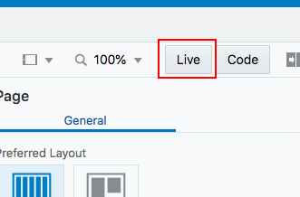

- Once in live mode, enter a new wine and click **Save**.(The save may take a few seconds, you'll know it's finished when you see the following screen and a notification that the save completed) You can enter your favorite wine or use the following example:

  - name: Ice
  - variant: white
  - quantity: 50
  - reserved: 0

  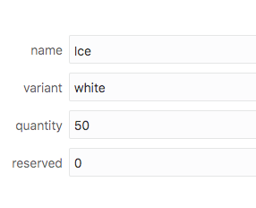

  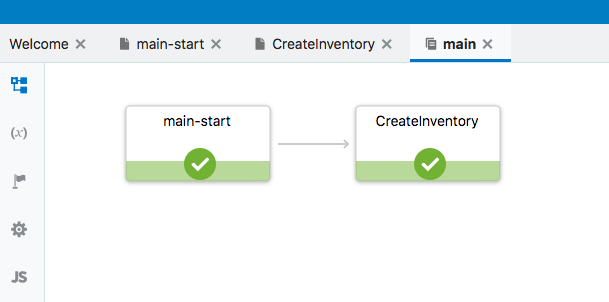

- To view our new entry let's go back to our apps main page, which you can access in the left side panel or in the tabs at the top of the page if you have not closed it. (Don't forget to exit live mode when you go back to the **CreateInventory** page designer by clicking on the "Play" arrow button.)

  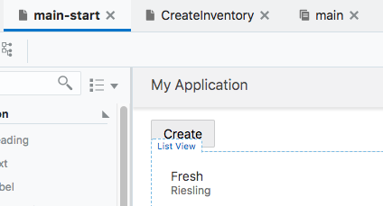

- Back in the **main-start** page you'll see our new entry is added to the list, and also note that there is a new **Create** button which was added for us by using the **Quick Start** guide to make our new create page. This is a major advantage to using the quick start guide for creating new pages, it will make buttons for us that will link to our new pages.

### Add Edit Page

- Now lets use the **Quick Start** guide to add an **Edit** page and a **Delete** button to our app's main page. Once again, click on the **List** component outside of a specific item so that the **List View** tag appears.

  

- Now the **List View** detail panel should be displayed on the right. Click on the **Quick Start** icon and we'll see the links to add pages. This time we'll add an **Edit** page. This will allow users to edit the inventory and reserve counts of the items. Click on **Add Edit Page** in the right panel.

  - 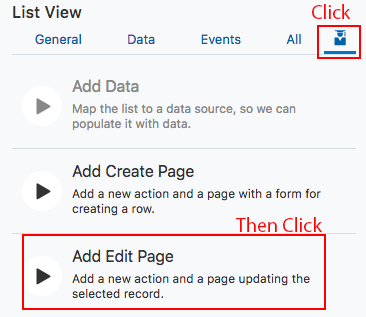

- On the **Select Read Endpoint** page we'll leave the default endpoint selected (GET /Inventory/{Inventory_Id}), and click **Next**. On the next step we'll leave the **Select Update Endpoint** set as the default (PATCH /Inventory/{Inventory_Id}) and click **Next**.

- In the **Page Details** step we'll select the fields we want displayed on our edit page, and then click **Finish**. Here we'll select:

  - Name
  - Variant
  - Quantity
  - Reserved

  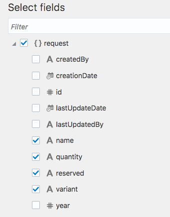

- Now if we go back to our "Main-start" page and again enter **Live** mode by clicking the "Live" button above the right panel we can test our edit page. Click on a list entry and the the **Edit Inventory** button will become active. Click on the **Edit Inventory** button to go to our new edit page we just created.

  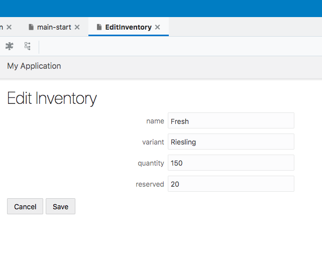

- This section of the web app will allow users to update items with new counts as they become available. If you would like to test the edit functionality, change a count and press save, otherwise just press cancel to return to the **main-start** page. Remember to exit **Live** mode by clicking the "Live" button in the top right.

- If we go back to our **main** tab we can now see our apps structure:

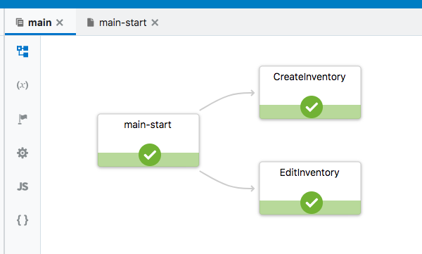

# Summary

We have now created an application in Autonomous Visual Builder Cloud Service, added our business data, and added pages to display, add to, and edit our data all with very little need for code.
