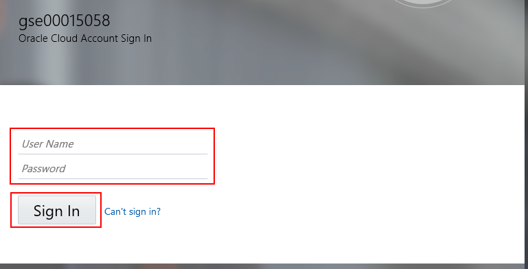
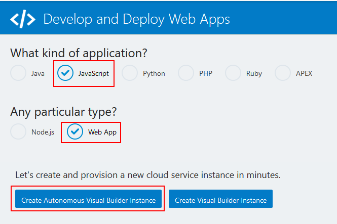
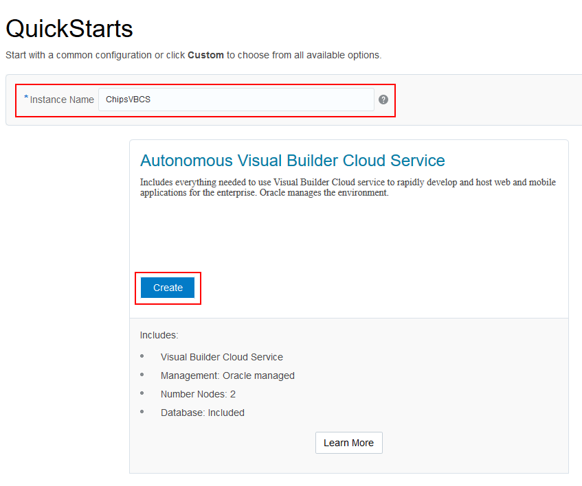
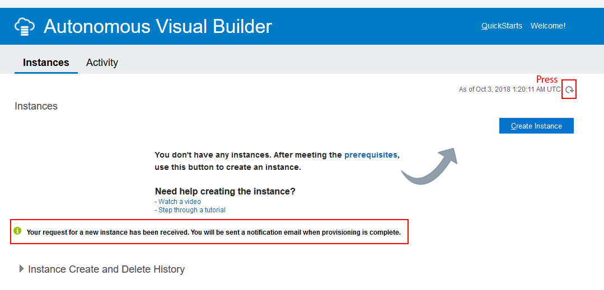
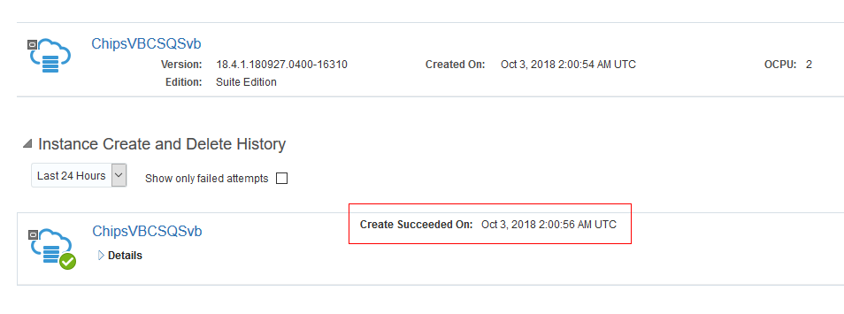

# Lab 50 - Provisioning a New Autonomous Visual Builder Cloud Service

## Introduction

During this lab we will take your new trial account and show you how to provision all the required components for a new Autonomous Visual Builder Cloud Service.

## Objectives

- Login to Your Cloud Account
  - Provision a New Instance

# Create an Application

### **STEP 1**: Login to your Oracle Cloud Account

- From any browser, go to the URL:
  `https://cloud.oracle.com`

- Click **Sign In** in the upper right hand corner of the browser and on the next screen enter you Cloud Account Name.

- Enter your User Name and Password provided for your trial account and click **Sign In**

    

- You will be presented with a Dashboard displaying the various cloud services available to this account.

  

- If the Visual Builder Cloud Service does not appear in your list click the customize dashboard button.

  

- Then select Visual Builder and click the show button.

- You should see the following before proceeding to the next step.

### **STEP 2**: Create a New Instance

- At the top of the page select the **Guided Journey** link.

- Next Select the **Develop and Deploy** option.

- Fill out the form below selecting **Javascript** and **Web App**. Then press the **Create Autonomous Visual Builder Instance** button.

- Name your instance and press create.

- You will see the following screen once your request is submitted. Press the refresh button every few minutes to see if your instance is provisioned.

- You should see your instance being created.

- When you see the following screen you can proceed to the next step.

- You may proceed to [Lab 100](LabGuide100.md)
