  
Updated: June 27, 2018

## Introduction

This is the first of several labs that are part of the **Oracle Autonomous Visual Builder Cloud Service workshop.** This workshop will walk you through creating applications for web and mobile from the browser using a visual development environment.

You will take on 2 Personas during the workshop. The **Javascript Developer Persona** will create the web application and add the associated business data. The Javascript Developer will then create the mobile application and link it to the web applications existing business data. The **IT Security Analyst Persona** will implement access controls in the applications and configure user accounts to allow access to the applications. During the workshop, you will get an overview of Oracle Autonomous Visual Builder Cloud Service and its features.

**_To log issues_**, click here to go to the [github oracle](https://github.com/oracle/learning-library/issues/new) repository issue submission form.

## Objectives

- Begin Creating a Web Application
  - Create application within Visual Builder user interface
  - Add busines data for application to display
- Create the Application Pages
  - Create pages for displaying business data
  - Create pages for creating and editing business data

## Required Artifacts

- The following lab requires an Oracle Public Cloud account that will be supplied by your instructor.

# Create an Application in Oracle Autonomous Visual Builder Cloud Service

### **STEP 1**: Login to your Oracle Cloud Account

- From any browser, go to the URL:
  `https://cloud.oracle.com`

- click **Sign In** in the upper right hand corner of the browser

  

- **IMPORTANT** - Under my services, select from the drop down list the correct data center and click on **My Services**. If you are unsure of the data center you should select, and this is an in-person training event, **_ask your instructor_** which **Region** to select from the drop down list. If you received your account through an Oracle Trial, your Trial confirmation email should provide a URL that will pre-select the region for you.

  

- Enter your identity domain and click **Go**.

  **NOTE:** The **Identity Domain, User Name** and **Password** values will be given to you by the instructor or Trial confirmation email.

  

- Once your Identity Domain is set, enter your User Name and Password and click **Sign In**

  **NOTE:** For this lab you will assume the role of Javascript Developer **_Lisa Jones_**. Although you are assuming the identify of Lisa Jones, you will log into the account using the **username** provided to you by your instructor, given to you by your corporation, or supplied to you as part of an Oracle Trial. As you progress through the workshop, you will remain logged in as a single user, but you will make “logical” changes from Lisa Jones the Javascript Developer to other personas.

  

  

- You will be presented with a Dashboard displaying the various cloud services available to this account.

  

- If all your services are not visible, **click** on the **Customize Dashboard**, you can add services to the dashboard by clicking **Show.** For this workshop, you will want to ensure that you are showing at least the **Application Container, Developer and Storage** cloud services. If you do not want to see a specific service, click **Hide**

  

### **STEP 2**: Access the Oracle Autonomous Visual Builder Cloud Service

Oracle Autonomous Visual Builder Cloud Service provides an easy way to
create and host web and mobile applications in a secure cloud
environment. An intuitive visual development experience on top of a
complete development and hosting platform accelerates application
creation and provisioning, leveraging an open, standard-based
architecture.

- From the Cloud UI dashboard click on the **Visual Builder** service.

  

- The Service Details page gives you a quick glance of the service status overview.

  

- Click **Open Service Console** for the Oracle Visual Builder Cloud Service. The Service Console will then list all Visual Applications.

  

### **STEP 4**: Create Visual Application

- Click **New** to start the application create wizard.

  

- On Details screen enter the following data and click on **Next**.

  In the Create Application dialog box, enter the following.

  - Application name: Application
  - Description: Tutorial application

  - The Application ID text field is automatically populated as you type based on the Application Name.
    

- You now have a new application, in which you can begin building pages and adding data.

  

# Import Business Data

### **STEP**: Import Files containing business data

#### Create Inventory Business Object and Import the Inventory Data

In this step you are assuming the identity of the Javascript, **_Lisa Jones_**.

- First we will import some data for our application to display. Click on the "hamburger" icon in the left panel to open the "Business Objects" panel and click the "menu icon next to the plus sign and click "Data Manager" to open the import tool.

  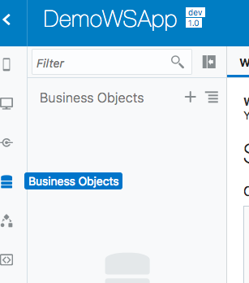

- A box will appear where you will enter the label for your new business object. Enter "Inventory" and click the check mark. (the Id field is automatically populated based on the label you provide)

  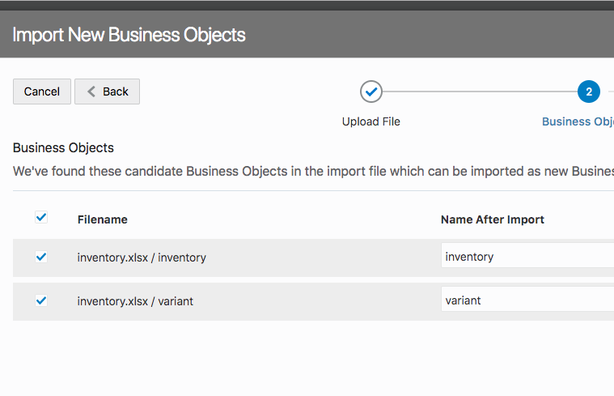

- In order to import the data to our business object the fields need to be created for the data to be placed into. Click the **Fields** tab, then click the **+ New Field** button. Here well add our fields to the auto generated fields.

  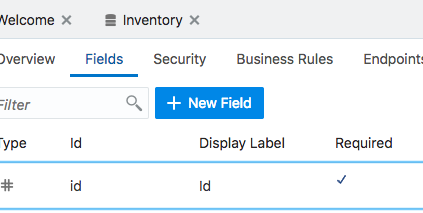

- For our first field enter name and select the **A** icon to set its field type as a string, then click the **check mark**.

  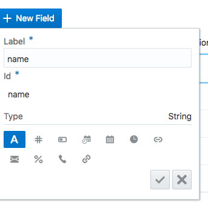

- Add the following fields and set their types:

  - variant, string
  - year, number
  - quantity, number
  - reserved, number

- Now we'll import the Inventory data from a file. Click on the **Data Manager** entry in the **Business Object** menu.

  

- Click **Import from File** and use the provided "Inventory.csv" file to import the data.

  

- You will see a popup stating that the import is taking place and it will confirm with a green check mark once the import is complete. (if there are any errors you may need to check your field names in the **Fields** tab against the headings in the provided CSV file and make sure they match)

  

- You can go back to the **Data** tab of the Inventory business object to verify or edit the data imported.

#### Create Variant Business Object and Import the Variant Data

- Now we will do the same process for bringing the variant data into the app. You can review the process we just completed for the inventory data if you need a reference.
- Create a new business object called "Variant" and add the following fields with the specified types:

  - type, string
  - variant, string

- Return to the **Data Manager** and import data from the **variant** file. We will import the data for the Variant business object. Visual Builder will know which business object to associate the data with by the file name of the data file, so make sure the file name matches the name of the business object.

- Check the **Data** tab of the Variant business object to see the imported data.

### **STEP Creating the Web App**:

Now that we have data for our app to display we can build our web app to display and modify that data.

- Click on the **monitor** icon in the left panel to open the web apps panel. Then click on the "+ Web Application" button to create a new web app.

  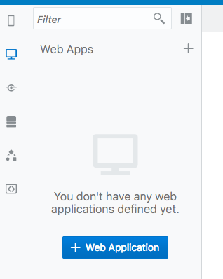

- Name your app "InventoryWebApp" and click **Create**.

  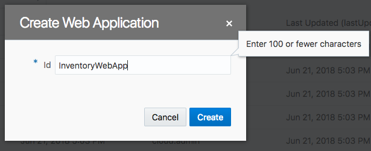

- Your applications canvas will open. This is where we will begin adding components to the page. You can expand the drop downs in the left panel to see where this page is in the structure of the app.

  

- To begin, we'll add a list to our page to display our added inventory data. scroll down in the components list panel and drag a **List View** onto our page.

  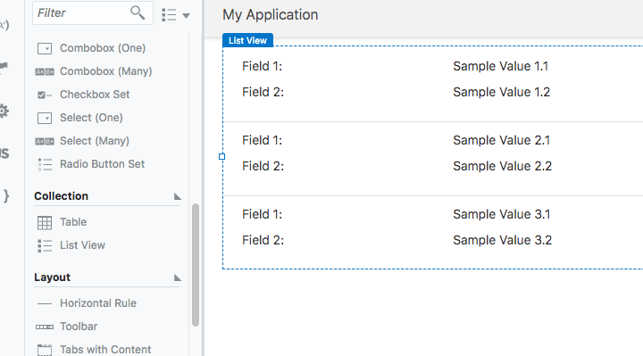

- To associate our inventory data with the list, in the right panel select **Add Data**. (If you DO NOT see **Add Data** you may need to expand the right panel or click on the **Quick Add** icon in the "List View" panel, highlighted below)

  

- There are several steps for selecting data for our list:

  - For **Select Endpoint** expand **Business Objects** > **Inventory** and select the **GET /Inventory** entry, then click **Next**.

  

  - For **Choose Template** we will use the default template which is at the top of the list and then click **Next**.

  

  - For our **Fields** we will select data from the **Endpoint Structure** and drag them into the **Fields** boxes. Drag the following items into the listed Field and then click **Next**:
    - "title1": name
    - "title2": variant
    - "value1": quantity
    - "value2": reserved

  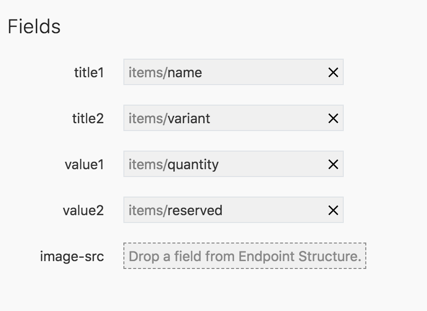

- We don't need to define a query for our data, so we can click **Finish**.

- At this point we have an application that will display our data and we can look at the the live app by clicking on the **Play** button in the top right corner.

  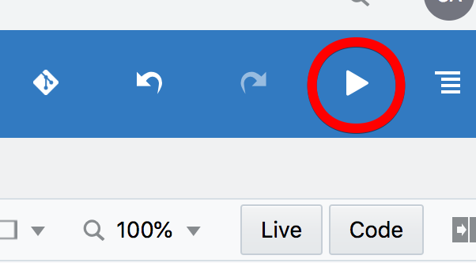

  - We have created a simple app to display our wine inventory...

  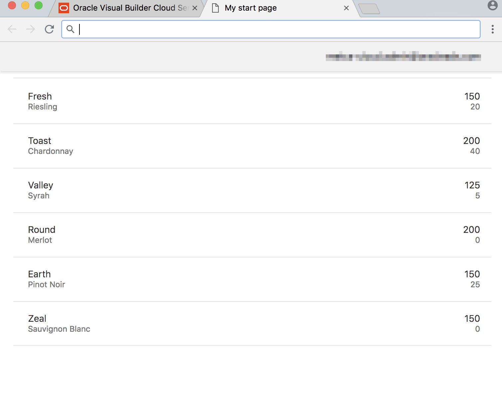

Our app is displaying our data but our inventory/reserved counts aren't labeled. Let's fix that so users will know what these numbers mean. To do that we can customize the data displayed in our list view.

- Leave the live view and return to the design view of your app. Select an item in the list so that it is highlighted with a blue border and a **List Item** tag.

  

- In the detail panel on the right side, select the **General** tab. We can add our label to the data in the fields. We add the label as a quoted string inside the double square brackets. So the data in the "Value1" field will contain the following

  `[["Inventory: " + $current.data.quantity]]`

  and the "Value2" field will have:

  `[["Reserved: " + $current.data.reserved]]`

* Now our app displays a list of the available wines with their inventory count and reserved count.

  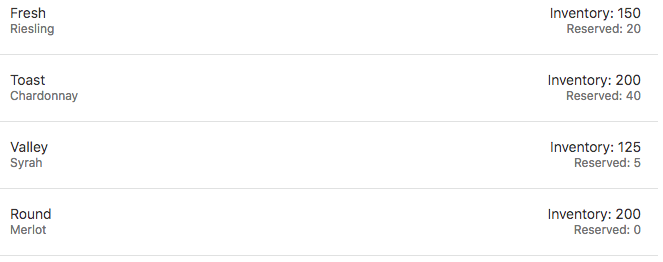
