# Lab 300 - Creating a Mobile Application

Updated: July 16, 2018

## Introduction

This is the third of several labs that are part of the **Oracle Autonomous Visual Builder Cloud Service workshop.** This lab will walk you through creating a mobile application and displaying inventory data.

**_To log issues_**, click here to go to the [github oracle](https://github.com/oracle/learning-library/issues/new) repository issue submission form.

## Objectives

- Create a mobile application
- Create mobile pages for an inventory items list and inventory items detail

## Required Artifacts

- The following lab requires an Oracle Public Cloud account that will be supplied by your instructor.

- This lab assumes that you have completed the previous labs in this series and created the items covered in those labs. If you have not, download the `DemoWSApp_MobileLabImport.zip` file and after creating an application in VBCS(instructions found in lab 100), import the zip file provided to set up the items created in the previous labs.

# Create a Mobile Application

### **STEP 1**: Add the Mobile App to Our Application

- If you are not already, log in to the Visual Builder Cloud Service(instructions on how to do so are in Lab 100)

- In your application development console, click on **Mobile** icon in the far left panel. It is the icon that resembles a mobile phone and is highlighted blue in the image below.

  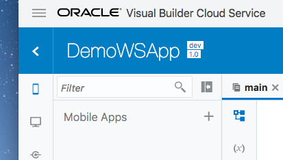

- Click the button **"+ Mobile Application"** to create a new mobile application instance.

  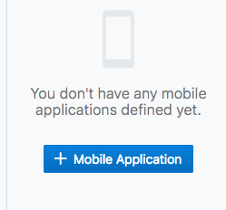

- You will be presented with the **New Mobile Application** window. In this window, name the mobile application **InventoryMobileApp** and choose the basic navigation style layout without a bottom bar, then click **Finish**.

  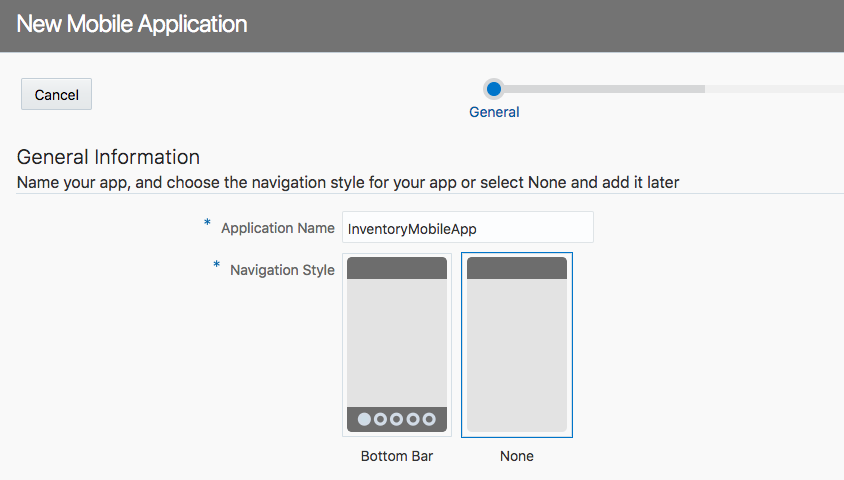

- If you still have your web application tabs open you may want to close those at this time to prevent any confusion. (Your applications pages can be configured to have custom names other than the names you see in the tabs but for our purposes the defaults will do.)

### **STEP 2**: Add Mobile App Pages

- At this point you should be seeing a view of your mobile application in the development console. We'll now begin adding pages to display an inventory overview and item details.

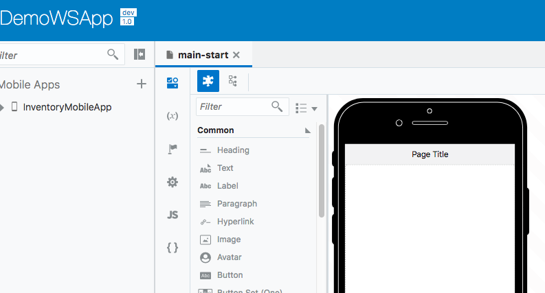

The steps to add pages will be familiar if you have completed the web application creation lab in this series.

The main page for our application is created for us automatically by AVBCS so we will begin by adding components to display our data.

- From the component list, drag a **List View** over to the mock phone and drop it on the page.

  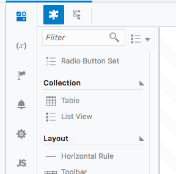

- You should see the default list view component on your app. Next we'll customize the data displayed.

  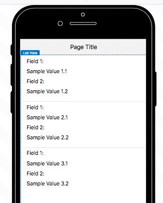

- To associate our inventory data with the list, in the right panel select **Add Data**. (If you DO NOT see **Add Data** you may need to expand the right panel or click on the **Quick Add** icon in the "List View" panel, highlighted below)

  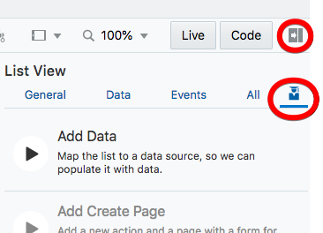

- VBCS assists us in selecting data for our list:

- For **Select Endpoint** expand **Business Objects** > **Inventory** and select the **GET /Inventory** entry, then click **Next**.

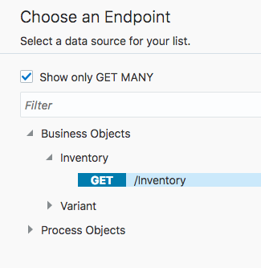

- For **Choose Template** we will use the default template which is at the top of the list and then click **Next**.

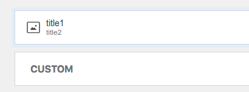

- For our **Fields** we will select data from the **Endpoint Structure** and drag them into the **Fields** boxes. Drag the following items into the listed Field and then click **Next**:
  - "title1": name
  - "title2": variant
  - "value1": quantity
  - "value2": reserved

- We don't need to define a query for our data, so we can click **Finish**.

  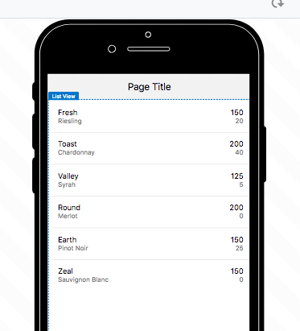

- At this point we have a mobile application that will display our data and we can look at the the live app by clicking on the **Play** button in the top right corner.

  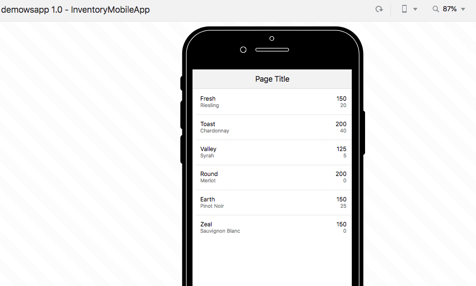

Our app is displaying our data but our inventory/reserved counts aren't labeled. Let's add labels so users will know what these numbers mean. To do that we can customize the data displayed in our list view.

- Exit **Live** mode and return to the design view of your app. Select an item in the list so that it is highlighted with a blue border and a **List Item** tag.

  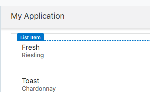

- In the detail panel on the right side, select the **General** tab. We can add our label to the data in the fields. We add the label as a quoted string inside the double square brackets. So the data in the "Value1" field will contain the following

  `[["Inventory: " + $current.data.quantity]]`

  and the "Value2" field will have:

  `[["Reserved: " + $current.data.reserved]]`

* Now our app displays a list of the available wines with their labeled inventory count and reserved count.

  
