# Lab 400 - Incorporating REST Data into the Application

Updated: July 16, 2018

## Introduction

This is the fourth of several labs that are part of the **Oracle Autonomous Visual Builder Cloud Service workshop.** This lab will walk you through creating a mobile application page for viewing an inventory item's details and also incorporating REST service data into the mobile application. We will be using the mobile application here to display the REST but if you would like to use a AVBCS web application the steps are similar.

**_To log issues_**, click here to go to the [github oracle](https://github.com/oracle/learning-library/issues/new) repository issue submission form.

## Objectives

- Create a mobile page for viewing inventory item details
- Add a REST Service Connection to the application
- Incorporate data retrieved from Service Connection into application

## Required Artifacts

- The following lab requires an Oracle Public Cloud account that will be supplied by your instructor.

- This lab assumes that you have completed the previous labs in this series and created the items covered in those labs. If you have not, download the `DemoWSApp_MobileLabImport_2.zip` file and after creating an application in VBCS(instructions found in lab 100), import the zip file provided to set up the items created in the previous labs.

# Create Mobile Pages for Inventory Details

Next we'll add a page to display inventory item details and once that is complete we'll incorporate data retrieved from a third party REST endpoint.

### Add a Inventory Details Mobile Page

- To begin adding the **Details**, open the **main-start** page where we have a list of the inventory items. Open the **Page Structure** panel by clicking the icon that resembles a diagram above the component list. This will make it easy to see all the components and select the **List View** component which we will work with next.

* After selecting the **List View** component from the **Page Structure** list you can close the **Page Structure** panel again by clicking on the icon again to regain screen space.

  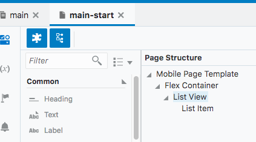

- With the **List View** component selected, open the **Quick Start** tab in the right panel and select **Add Detail Page**.

  

- Select the GET endpoint of the Inventory Business Object and click **Next**.

  

- On the **Page Details** step, select the following items in the order listed and then click **Finish**.

  - Name
  - Variant
  - Inventory
  - Reserved

    

- We can now test the inventory item details page to see our newly created page. Click on the "Live" button in the top right corner of the development console to enable live mode and then click an item in the inventory list.

  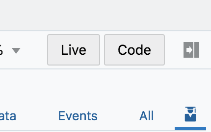

- This will open our new **Inventory Detail** page and display the information from the item we have selected. You'll see that the page is already created for us including a back button that will navigate back to the overall inventory list. Exit "Live" mode by clicking the "Live" button again.

- Now we'll add an image to our detail page. From the component list in the left panel, drag an "Image" component onto the Inventory Detail page so that it is placed between the title bar and our "List" component. You should now have a layout with a blank image on it.

  

- We can upload an image to VBCS for use in our app. In the left column of the development console expand **inventorymobileapp > resources** so that the **Images** is visible. Right click on **Images** and click **Import**.

  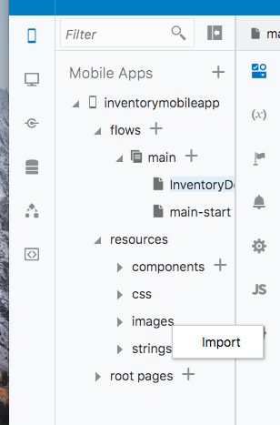

- Import the `wineGlass.png` image provided. (If the image is not listed in the left panel after importing, you may need to refresh your browser window)

  

- Back on the **Inventory Detail** page select the image component and select the **Data** tab. The resources are accessed in the applications file structure so we will set the **Source URL** on the **Data** tab as `./resources/images/wineGlass.png` and press enter. You should now see an image on our page. (In this example we've used a generic image but we could have also used a variable insead of a source URL and referenced a different image for each inventory item.)

  

- Our next steps will involve adding data to this detail page which is retrieved from an external REST service.

### Add REST Service Connection

- We will now add the Service Connection through which data will be retrieved from an external REST endpoint. If you are not already, log in to the Visual Builder Cloud Service(instructions on how to do so are in Lab 100).

- In your application development console, click on **Service Connections** icon in the far left panel. It is the icon that looks like a circle with a line through it and is highlighted blue in the image below.

  

- Click the button **"+ Service Connection"** to create a new service connection instance.

  

- In the **Create Service Connection** window, we will choose **Define by Endpoint** as our source.

  

- "GET" is the **Method** selected in dropdown menu. Next, enter the following address in the URL field:

  `http://jsonplaceholder.typicode.com/posts/1`

- Select "Retrieve One" in the **Action Hint** dropdown menu, then click **Next**. (For this example we will be doing a simple GET request returning one record containing placeholder data)

  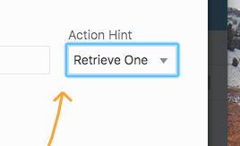

- You'll see on the next screen that AVBCS populates some fields with information from the address we have provided. The **Service Name** and **Service ID** are filled in for us.

  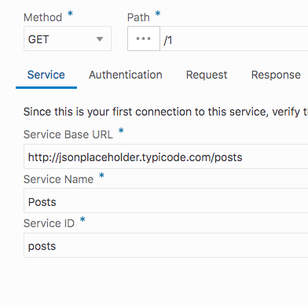

- Click on the **Test** tab to try our connection and make sure it works. On the **Test** tab, click **Send** and review the data returned.

  

- If the data comes back successfully, click **Copy to Response Body** to inform VBCS of the response structure.

  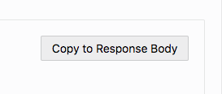

- Check the **Response** tab to see the response is now in the "Example" text area, then click **Create**.

  

- Once created, the development console will display the tab of the new service connection.

  

- Now that the connection is configured we'll add the response data to our detail page. To do so we'll set up a variable on the page to store the response and define an action to call the connection for the data.

# Displaying Data Retrieved from a REST Call

There are a few steps to integrating REST data into our app. First we'll need to set up a variable on our page to hold the response data from the REST call. VBCS comes with built in variable types but it also allows us to define our own custom types. The response from a REST call is a great use case for these custom type definitions. We'll create a new type from our service connection response structure which will be the type we use for our variable. So to summarize we will need to:

- Define a variable type based on the REST response
- Define a variable to hold our response data
- Create an **Action Chain** that retrieves our data and assigns it to the variable
- Configure an event that will trigger our action chain and make the data available via the variable

### Define Custom Variable Type

- In the left panel of our developer console, select **main** under **inventoryMobileApp > flows** and then once on the **main** flow, select the **(x)** icon to display the variables of that flow.

  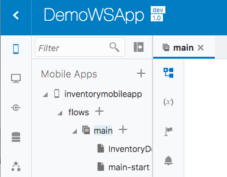

- Select the **Types** tab and click the **+ Type** button on the right and click **From Endpoint**.

  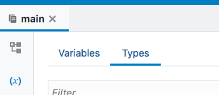

  

- For the type's endpoint expand **Service Connections > Posts** and choose **GET /1** and click **Next**.

  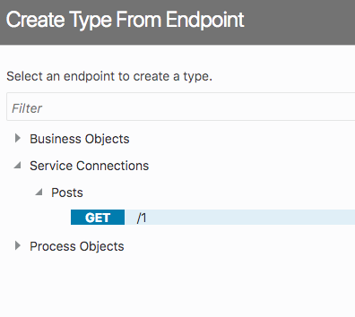

- In the **Endpoint Structure** step, check the box next to **{}Response** to select all the items in the response structure. Click **Finish**.

  

#### Create Variable

- We now have our type that will be used in our variable definition, let's set up our variable. Go back to the **Variables** tab and click on the **+ Variable** button to begin creating a variable. In the **New Variable** window that opens, enter `itemDescription` as the new variable's Id and choose our newly created **get1** from the dropdown menu as the type, then click **Create**.

  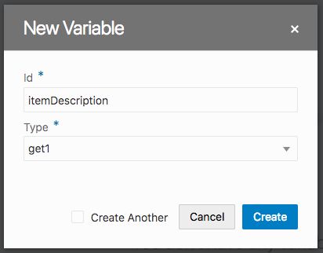

- You'll now see the variable listed in the **Main** flow's variable list. This gives us a place to store the retrieved data and a reference we can use to store it and retrieve it from the app.

### Define Action Chain

- Now that the variable which will hold our response is created we can define the **Action Chain** that will retrieve the data from our **Service Connection** and store it in the variable.

- Click on the icon that resembles a flag to open **Actions** and click the **+ Actions Chain** button.

  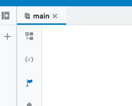

- Set the Id of the action chain as `retrieveItemDescription` and click **Create**.

  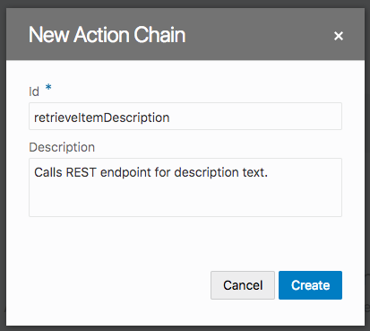

- You should now see the **Action Chain** configuration tab displayed. This is where we'll set the steps it should perform.

  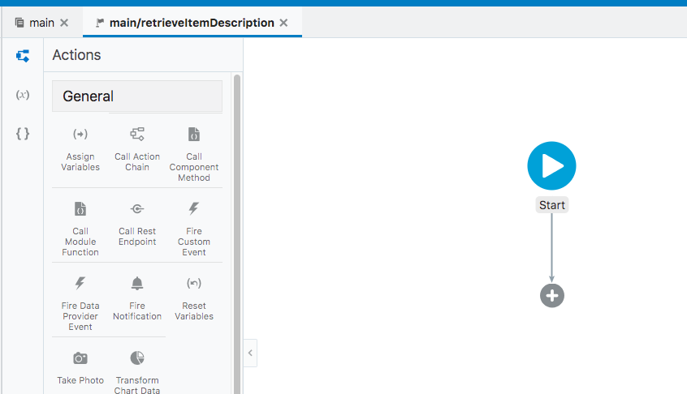

- For our purposes we'll need two steps, first call a REST endpoint and second, assign the response to a variable. You'll see on the left, there is a panel of pre-created action templates ready to use that we can drag onto the chain. Drag the icon for **Call Rest Endpoint** onto the "plus sign under the **Start** icon in the chain.

  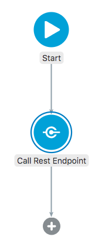

- In the right panel there will be a button for selecting the endpoint, click that button to open the endpoint configuration. In the **Select Endpoint** window, expand **Service Connections > Posts** and select **GET** then click **Select**.

  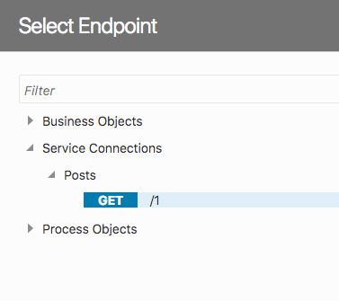

- For the next step in the chain, we'll assign the response to our variable. In the list of action templates in the left panel, drag **Assign Variables** onto the plus sign at the bottom of the chain.

  

- Once that's added to our chain the right panel will have the assignments configurations options. There is a link to open the assignment window accessable via the **Assign** text next to the Variables heading in the right panel. Clicking this will open the **Map Variables To Parameters** window.

  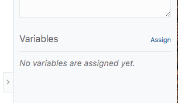

- Under the **Sources** column on the left, expand "callRestEndpoint1" and drag "body" over and drop it onto the "itemDescription" under **Flow** in the **Target** column on the right . When you drop it on the "itemDescription" you should get a line drawn between the items. Click **Save**.

  

### Bind Action Chain to App Event

- The action chain is now ready to do it's work, now we'll tell our app what event should be used to trigger this action chain. Click on the **InventoryDetail** tab (or if it's closed, open from the panel on the left) and then drag a button from the components column onto the page between the image and the list components. In the button's configuration panel on the right side change the **Text** from "button" to "More Info" and choose the "Full" chroming option to make our button stand out a little more. Next click the **Events** tab. Once on the **Events** page, click the **+ Event Listener** button to begin linking our action chain to an event.

  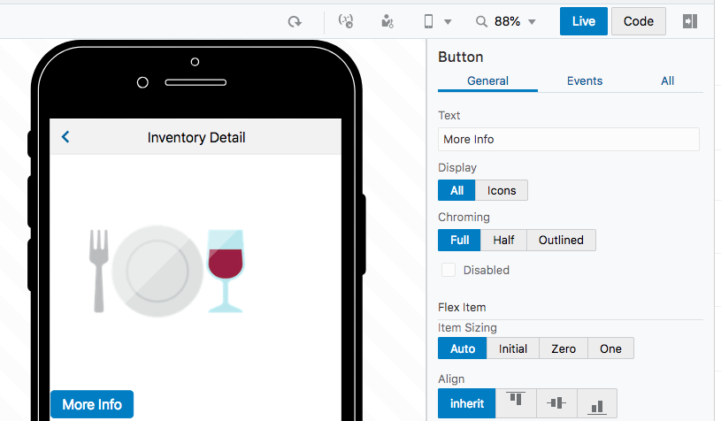

- VBCS allows us to quickly add events to our buttons. In the **Events** tab click **+ New Event** and choose "Quick Start: 'click' ". This will add a click event to the button.

  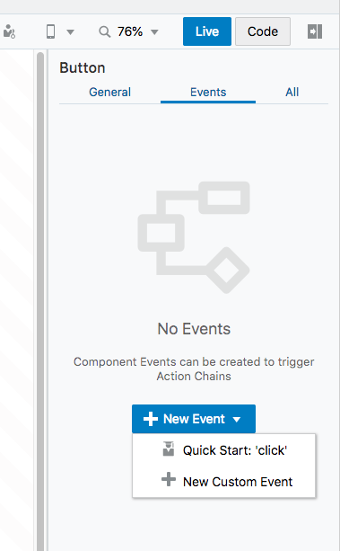

- Drag the **Call Action Chain** from the action collection panel on the left to the bottom of the chain and then click the **Select Action Chain** button in the right panel.

  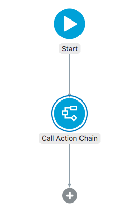

- Next select our action chain "retrieveItemDescription" and click **Select**.

  

- Our pieces are all tied together, when the button is clicked on the inventory detail page it will trigger our action chain that in turn calls our service connection and stores the response of that call in our variable. All that's left to do now is display the data stored in the variable in our app.

### Display REST Response Variable Data

- Navigate back to the **Mobile App** section of the development console and expand **inventoryMobileApp > flows > main** and select our **InventoryDetail** page.

  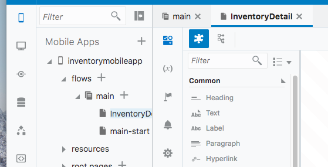

- Drag a "Text" component from the left column into the **Inventory Detail** page. You'll see a text box with a placeholder message of "Bind Text."

- Now we'll set the text to be the data retrieved from the REST call.

  - With the text box selected, hover over the "Value" field in the right panel and a small **(x)** will appear. Click that **(x)** to assign a variable to the text field.
  - In the dropdown, expand **Flow > itemDescription** and select **body**. This will display the value in that variable on our Inventory detail page when when our button is clicked.

  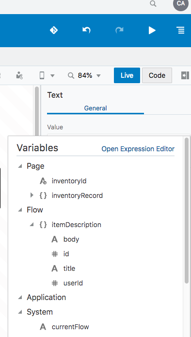

- Let's test our button. Go back to the **main-start** page which lists our inventory items, enable **Live** mode by clicking on the "Live" button in the top right corner. Once in **Live** mode, click an item in the list, then when the **itemDetail** page loads test our button to verify it displays our new information.

  
