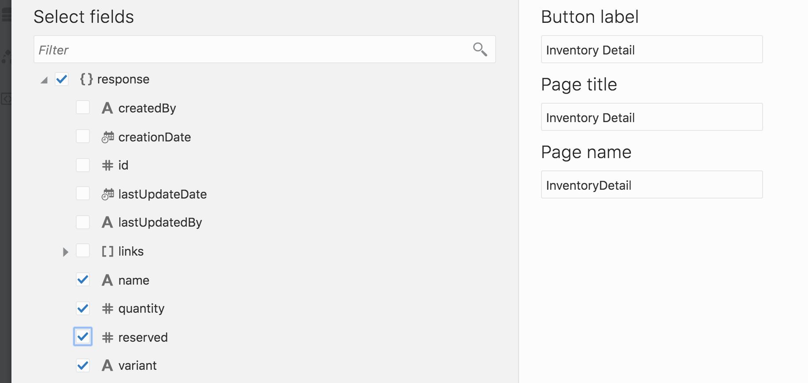
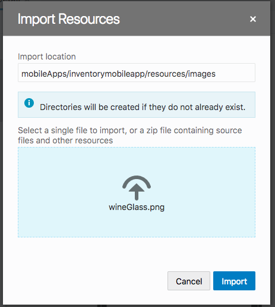
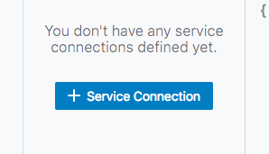
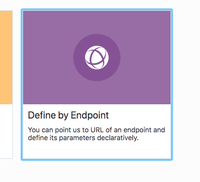
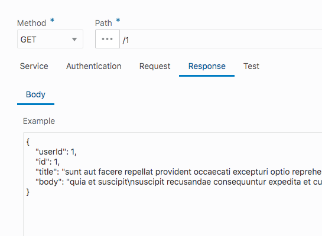

  
Updated: July 10, 2018

## Introduction

This lab is one of a series which provides an overview of Oracle Autonomous Visual Builder Cloud Service(VBCS).

**_To log issues_**, click here to go to the [github oracle](https://github.com/oracle/learning-library/issues/new) repository issue submission form.

## Objectives

- Create a mobile page for viewing inventory item details
- Add a REST Service Connection to the application
- Incorporate data retrieved from Service Connection into application

## Required Artifacts

- This lab assumes that you have completed the previous labs in this series and created the items covered in those labs. If you have not, download the `DemoWSApp_MobileLabImport_2.zip` file and after creating an application in VBCS(instructions found in lab 100), import the zip file provided to set up the items created in the previous labs.

# Add a Inventory Details Mobile Page

- Next we'll add a page to display inventory item details and once that is complete we'll incorporate data retrieved from a third party REST endpoint.

- To begin adding the **Details**, open the **main-start** page where we have a list of the inventory items. Open the **Page Structure** panel by clicking the icon that resembles a diagram above the component list. This will make it easy to see all the components and select the **List View** component which we will work with next.

* After selecting the **List View** component from the **Page Structure** list you can close the **Page Structure** panel again by clicking on the icon again to regain screen space.

  

- With the **List View** component selected, open the **Quick Start** tab in the right panel and select **Add Detail Page**.

  

- Select the GET endpoint of the Inventory Business Object and click **Next**.

  

- On the **Page Details** step, select the following items in the order listed and then click **Finish**.

  - Name
  - Variant
  - Inventory
  - Reserved

    

- We can now test the inventory item details page to see our newly created page. Click on the "Live" button in the top right corner of the development console to enable live mode and then click an item in the inventory list.

  

- This will open our new **Inventory Detail** page and display the information from the item we have selected. You'll see that the page is already created for us including a back button that will navigate back to the overall inventory list. Exit "Live" mode by clicking the "Live" button again.

- Now we'll add an image to our detail page. From the component list in the left panel, drag an "Image" component onto the Inventory Detail page so that it is placed between the title bar and our "List" component. You should now have a layout with a blank image on it.

  

- We can upload an image to VBCS for use in our app. In the left column of the development console expand **inventorymobileapp > resources** so that the **Images** is visible. Right click on **Images** and click **Import**.

  

- Import the `wineGlass.png` image provided. (If the image is not listed in the left panel after importing, you may need to refresh your browser window)

  

- Back on the **Inventory Detail** page select the image component and select the **Data** tab. The resources are accessed in the applications file structure so we will set the **Source URL** on the **Data** tab as `./resources/images/wineGlass.png` and press enter. You should now see an image on our page. (In this example we've used a generic image but we could have also used a variable insead of a source URL and referenced a different image for each inventory item.)

  

- Our next steps will involve adding data to this detail page which is retrieved from an external REST service.

# Add REST Service Connection

- We will now add the Service Connection through which data will be retrieved from an external REST endpoint. If you are not already, log in to the Visual Builder Cloud Service(instructions on how to do so are in Lab 100).

- In your application development console, click on **Service Connections** icon in the far left panel. It is the icon that looks like a circle with a line through it and is highlighted blue in the image below.

  

- Click the button **"+ Service Connection"** to create a new service connection instance.

  

- In the **Create Service Connection** window, we will choose **Define by Endpoint** as our source.

  

- "GET" is the **Method** selected in dropdown menu. Next, enter the following address in the URL field:

  `http://jsonplaceholder.typicode.com/posts/1`

- Select "Retrieve One" in the **Action Hint** dropdown menu, then click **Next**. (For this example we will be doing a simple GET request returning one record containing placeholder data)

  

- You'll see on the next screen that AVBCS populates some fields with information from the address we have provided. The **Service Name** and **Service ID** are filled in for us.

  

- Click on the **Test** tab to try our connection and make sure it works. On the **Test** tab, click **Send** and review the data returned.

  

- If the data comes back successfully, click **Copy to Response Body** to inform VBCS of the response structure.

  

- Check the **Response** tab to see the response is now in the "Example" text area, then click **Create**.

  

- Once created, the development console will display the tab of the new service connection.

  

- Now that the connection is configured we'll add the response data to our detail page. To do so we'll set up a variable on the page to store the response and define an action to call the connection for the data.

### Displaying Date Retrieved from a REST Call

- First we'll need to set up a variable on our page to hold the response data from the REST call.
